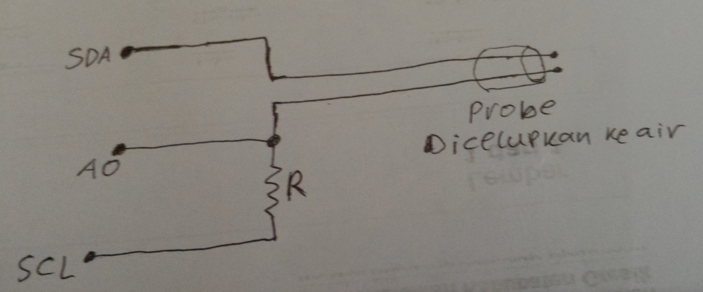

# iot-hidroponik
Projek iot untuk hidroponik menggunakan Wemos D1 R3.

# Wiring
* Board dihubungkan dengan RTC1307 lewat I2C.
* Board ke `SD Card Shield` lewat koneksi `SPI` (MISO, MOSI, SCK, SS).
* Relay yang dipakai hanya dua yaitu untuk menyalakan pompa dan selenoid valve. Relay dihubungkan lewat port `D3` dan `D4`.
* Untuk sensor tds menggunakan 3 pin yaitu `SDA`, `SCL` dan `A0`. Ide dasarnya dari [sini](https://hackaday.io/project/7008-fly-wars-a-hackers-solution-to-world-hunger/log/24646-three-dollar-ec-ppm-meter-arduino) dengan modifikasi sana sini :D

# Serial `command`
Wemos sendiri dapat diprogram lewat serial port. Perintah-perintah yang tersedia adalah

* ssid:<SSID>:<PASSWORD>  => Digunakan untuk mengganti koneksi wifi. Contoh ssid:cakmunir:rahasia
* ip => Mendapatkan IP address dari wemos
* tds => Membaca nilai kepekatan larutan
* now => Membaca waktu sekarang dari RTC
* set_time:<FORMAT> => Menset waktu dari RTC module. Format yang dipakai adalah "YY-MM-DD HH:ii:SS [W]". Contoh set_time:17-09-05 11:34:26 2
* konfig:<VALUES> => Menset nilai dari beberapa pengaturan antara lain ppm, periode pompa, durasi nyala pompa. Contoh konfig:p1200;t30;d5 -> menset kepekatan larutan menadi 1200 ppm, periode nyala pompa 30 menit serta durasi pompa 5 menit.

# Kalibrasi tds meter

1. Set nilai `C0` = `0.0` dan `C1` = `1.0` pada fungsi `getTds()`.
1. Celupkan probe pada larutan yang sudah diketahui konsentrasinya.
1. Ketik tds di serial monitor, catat angka yang muncul.
1. Ulangi langkah 2 dan 3 pada larutan yang berbeda-beda konsentrasinya.
1. Dari angka-angka tersebut kemudian di`regresi`kan untuk mendapatkan nilai `C0` dan `C2`.

